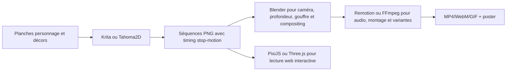

# Recherche — stacks pour une animation stop-motion numérique Down Trigger

- **Date de recherche :** 2026-09-08
- **Niveau de confiance global :** élevé pour les capacités documentées ; moyen pour les préférences Reddit
- **Sujet :** choisir une chaîne de production adaptée à un clip stop-motion construit à partir de planches de personnages, de poses-clés, de décors et d’un montage musical.
- **Statut :** recherche terminée ; recommandation proposée, non encore inscrite comme décision canonique.

## Synthèse exécutive

Pour le prototype Down Trigger, la chaîne la plus cohérente est hybride : **Krita ou Tahoma2D/OpenToonz pour les poses et l’animation image par image, Blender pour les plans avec caméra/profondeur/effets, puis FFmpeg ou Remotion pour le montage et les exports**. Cette séparation respecte la logique du stop-motion tout en évitant de forcer un seul logiciel à faire dessin, staging 2.5D, compositing, audio et livraison.

OpenToonz est un logiciel 2D complet et libre, tandis que Tahoma2D se présente explicitement comme un logiciel 2D et stop-motion dérivé de Toonz ; Krita est très efficace pour l’animation raster image par image mais documente lui-même ses limites en montage audio/vidéo et en mémoire sur les longues séquences. [citation:OpenToonz — dépôt officiel](https://github.com/opentoonz/opentoonz) [citation:Tahoma2D — dépôt officiel](https://github.com/tahoma2d/tahoma2d) [citation:Animation with Krita](https://docs.krita.org/en/user_manual/animation.html)

Blender est le meilleur candidat pour les plans de chute vers le cœur : Grease Pencil permet l’animation traditionnelle, le cut-out et l’animation dans une scène 3D ; la suite couvre aussi caméra, rendu, compositing et montage. [citation:Blender Manual — Grease Pencil](https://docs.blender.org/manual/en/4.3/grease_pencil/introduction.html) [citation:Blender — dépôt officiel](https://github.com/blender/blender)

## Périmètre et besoins du clip

- Personnage masqué récurrent, dont la silhouette doit rester stable d’un plan à l’autre.
- Planche de poses et animation saccadée volontaire, proche d’un rendu stop-motion.
- Décor minéral déformé par une attraction centrale : planète, gouffre, débris, veines électriques.
- Possibilité de séparer personnage, décor, logo, effets et caméra.
- Montage sur une musique, avec versions courtes, verticales et éventuellement intégration web.
- Conservation des sources éditables et export d’une séquence d’images pour éviter un verrouillage prématuré dans un seul fichier vidéo.

## Cartographie des stacks

### 1. Krita → éditeur vidéo → FFmpeg

Krita fournit une timeline raster image par image, des calques animés et l’onion skinning ; sa documentation recommande un storyboard puis un animatic, et conseille de limiter les premiers essais à 12 images par seconde. Elle avertit aussi que les longues animations consomment rapidement la RAM et que le montage audio/vidéo doit être confié à un outil séparé. [citation:Animation with Krita](https://docs.krita.org/en/user_manual/animation.html) [citation:Krita Animation Timeline Docker](https://docs.krita.org/en/reference_manual/dockers/animation_timeline.html)

**Forces :** excellent pour peindre les poses, les textures papier/cendre et les variations expressives ; prise en main directe ; adapté à une planche ou à de courtes scènes.

**Faiblesses :** moins adapté comme centre de gravité d’un clip long ; consommation mémoire ; montage et synchronisation audio limités.

**Fit Down Trigger :** très bon pour créer les planches de personnages et les poses-clés ; moyen comme pipeline complet.

### 2. Tahoma2D / OpenToonz

OpenToonz est un environnement 2D complet avec Xsheet, niveaux raster/vectoriels, effets et outil Plastic ; Tahoma2D reprend cette base en se positionnant explicitement sur la 2D et le stop-motion. Le dépôt Tahoma2D expose une activité récente et des versions Windows, macOS et Linux. [citation:OpenToonz — dépôt officiel](https://github.com/opentoonz/opentoonz) [citation:Tahoma2D — dépôt officiel](https://github.com/tahoma2d/tahoma2d) [citation:Tahoma2D — outil Plastic](https://github.com/tahoma2d/tahoma2d_docs/blob/master/source/create_animations_using_plastic_tool.rst)

**Forces :** vraie logique de production 2D, Xsheet/timeline, niveaux, caméra et compositing ; meilleur candidat si le clip devient une série de scènes image par image ; Tahoma2D est souvent recommandé par la communauté comme interface plus accessible.

**Faiblesses :** courbe d’apprentissage et ergonomie moins immédiate ; la 2.5D spectaculaire et les scènes volumétriques restent moins naturelles que dans Blender.

**Fit Down Trigger :** très bon pour une production stop-motion 2D structurée ; excellent compromis libre si le rendu final reste illustré et découpé.

### 3. Blender + Grease Pencil + compositor

Grease Pencil accepte les dessins image par image, les déformations et le cut-out dans un espace 3D ; Blender apporte aussi caméra, éclairage, simulation, rendu, compositing et montage dans la même suite. [citation:Blender Manual — Grease Pencil](https://docs.blender.org/manual/en/4.3/grease_pencil/introduction.html) [citation:Blender — dépôt officiel](https://github.com/blender/blender)

**Forces :** idéal pour la caméra qui plonge vers le trou noir, les couches de profondeur, les débris, les rotations de décor et les effets ; possibilité de garder le personnage en 2D tout en animant un décor 3D/2.5D ; automatisable en Python.

**Faiblesses :** le logiciel pense en 3D même lorsqu’on travaille en 2D ; l’animation traditionnelle pure peut devenir plus lente à organiser ; les retours Reddit signalent une courbe d’apprentissage et des menus moins naturels pour un artiste 2D.

**Fit Down Trigger :** meilleur choix pour les plans-clés de caméra, d’aspiration et de compositing ; moins pertinent comme unique outil si toutes les poses doivent être dessinées à la main.

### 4. Remotion + React + FFmpeg

Remotion permet de décrire une vidéo en React et de la rendre en images ou en vidéo ; son renderer expose notamment le rendu de frames et l’assemblage d’une séquence en vidéo. [citation:Remotion — organisation GitHub](https://github.com/remotion-dev) [citation:@remotion/renderer](https://www.npmjs.com/package/%40remotion/renderer) [citation:Remotion — stitch frames](https://github.com/remotion-dev/remotion/blob/main/packages/renderer/src/stitch-frames-to-video.ts)

**Forces :** timings explicites, synchronisation musicale, variations de format, génération répétable, prévisualisation web, paramètres contrôlables par schéma.

**Faiblesses :** ce n’est pas l’outil de dessin image par image ; il faut déjà posséder les frames ou les assets ; les conditions de licence et d’usage commercial doivent être relues avant adoption, car le projet officiel documente un cadre commercial et des restrictions de redistribution. [citation:Remotion — contribution et licence](https://github.com/remotion-dev/remotion/blob/main/packages/docs/docs/contributing/index.mdx)

**Fit Down Trigger :** très bon pour l’animatic, le montage paramétrique et les déclinaisons ; à placer après la création des assets, pas à la place de l’animation.

### 5. FFmpeg comme couche d’export

FFmpeg lit et écrit les images d’une séquence vidéo et prend en charge de nombreux formats d’image, dont PNG, WebP, GIF et APNG ; il constitue une couche robuste pour assembler une série d’images, muxer l’audio et produire des versions de livraison. [citation:FFmpeg — documentation générale](https://www.ffmpeg.org/general.html) [citation:FFmpeg — dépôt officiel](https://github.com/FFmpeg/FFmpeg)

**Forces :** déterministe, scriptable, adapté aux séquences d’images et aux exports batch ; indépendant du logiciel de dessin.

**Faiblesses :** aucune aide artistique ni timeline de création ; les commandes doivent être encapsulées dans un script reproductible.

**Fit Down Trigger :** indispensable comme couche de rendu/export, mais pas comme outil d’animation.

### 6. PixiJS ou Three.js pour le web

PixiJS charge des textures, GIF, WebP, vidéos et spritesheets ; ses spritesheets et `AnimatedSprite` conviennent à une animation par poses sur une page web, avec cache d’assets et réduction du nombre de requêtes. [citation:PixiJS — assets](https://pixijs.com/8.x/guides/components/assets) [citation:PixiJS — spritesheets](https://pixijs.com/7.x/guides/components/sprite-sheets)

Three.js fournit un système d’animation piloté par `AnimationMixer`, clips et pistes de keyframes pour des objets 3D ou des assets animés importés. [citation:Three.js — Animation System](https://threejs.org/manual/en/animation-system.html) [citation:Three.js — AnimationMixer](https://threejs.org/docs/pages/AnimationMixer.html)

**Forces :** interaction, parallaxe, masque du portail, lecture conditionnelle, intégration directe au portfolio.

**Faiblesses :** ce sont des couches de lecture/rendu web, pas des logiciels de production 2D ; une séquence complète en images peut être lourde si elle n’est pas empaquetée et préchargée.

**Fit Down Trigger :** PixiJS pour un personnage ou une série de poses interactive ; Three.js pour une scène 2.5D et un portail ; aucun des deux ne doit devenir le logiciel principal de fabrication du clip.

## Ce que Reddit confirme — et ce qu’il faut relativiser

Les échanges Reddit sont cohérents sur quatre points, mais restent des retours d’expérience et non des spécifications techniques.

1. **OpenToonz/Tahoma2D est préféré quand la priorité est le frame-by-frame 2D.** Plusieurs discussions décrivent Blender comme puissant mais plus « 3D dans sa tête », alors que Tahoma2D est souvent conseillé comme variante plus accessible d’OpenToonz. [citation:Should I use OpenToonz instead of Blender GP?](https://www.reddit.com/r/OpenToonz/comments/1i04x8p) [citation:Opentoonz or Tahoma2d](https://www.reddit.com/r/OpenToonz/comments/1vrlfyf)

2. **Blender est préféré quand la caméra et la profondeur deviennent déterminantes.** Des utilisateurs citent l’espace 3D, les mouvements de caméra, le compositing et les effets comme avantages décisifs ; les mêmes retours signalent une organisation plus difficile pour l’animation 2D pure. [citation:How does it feel to use Blender in 2D animation production?](https://www.reddit.com/r/blender/comments/dz5jt8) [citation:How to achieve this 3D look that mimics 2D animation?](https://www.reddit.com/r/blenderhelp/comments/1h3o3oo)

3. **Le workflow mixte est courant : Krita pour les dessins/poses, OpenToonz/Tahoma2D pour la scène et le compositing, Blender pour certains plans ou effets.** Un dépôt GitHub dédié exporte les animations Krita vers des scènes OpenToonz/Tahoma2D en conservant calques et timing ; plusieurs échanges Reddit décrivent le même découpage. [citation:KritaToOpenToonz exporter](https://github.com/konero/KritaToOpenToonz) [citation:Good Production Workflow? Krita vs OpenToonz?](https://www.reddit.com/r/animation/comments/gfjvlt)

4. **L’animatic et la préproduction sont le vrai accélérateur.** Un retour récent sur Remotion insiste sur le storyboard, les plans séparés, les timings et les paramètres de caméra avant le détail ; un autre fil rappelle qu’un plan 2D/3D doit être grayboxé et que la caméra doit être validée avant de produire toutes les frames. [citation:I made a launch video with Remotion](https://www.reddit.com/r/SideProject/comments/1t75gj8) [citation:Combining 2D and 3D in Blender](https://www.reddit.com/r/blender/comments/1i0qa0u)

## Recommandation pour Down Trigger

### Proposition principale — pipeline hybride en quatre couches

**Choix proposé pour le prototype actuel :** conserver la logique d’images-clés et produire les scènes en petites unités ; utiliser Blender pour les plans où la planète se courbe et où la caméra plonge ; utiliser FFmpeg ou Remotion pour caler le montage sur la musique ; réserver PixiJS/Three.js à l’intégration web du portfolio.

**Pourquoi ce choix :** il garde la maîtrise artistique du personnage et du masque, permet une vraie caméra de profondeur pour le trou noir, et laisse une sortie web légère et remplaçable. Il évite aussi de transformer le site Astro existant en moteur de fabrication vidéo.

### Variante économique pour avancer vite

Krita → séquences PNG → FFmpeg → animatic. C’est le chemin le plus court pour tester rythme, paroles et découpage. Il ne faut pas en déduire que Krita est le meilleur outil pour un clip long ; sa propre documentation recommande de séparer l’animatic et le montage.

### Variante production 2D structurée

Tahoma2D/OpenToonz → séquences et compositing → FFmpeg. À privilégier si le style reste principalement dessiné, avec beaucoup de poses, de niveaux et de reprises manuelles.

### Variante plans spectaculaires

Krita/Tahoma2D pour les personnages → Blender Grease Pencil/2.5D pour les décors et mouvements de caméra → FFmpeg/Remotion. C’est la variante la plus adaptée à la planète qui se déforme et au plongeon dans le core.

## Arbitrages encore ouverts

- **Animation du personnage :** redessin image par image, marionnette 2D découpée ou combinaison des deux.
- **Rendu final :** grain artisanal assumé ou compositing plus propre et cinématographique.
- **Destination prioritaire :** clip autonome, teaser vertical, ou séquence intégrée au portfolio web.
- **Licence Remotion :** à vérifier pour le mode exact d’exploitation avant de l’intégrer à une chaîne commerciale.
- **Asset critique :** une planche isolée et canonique du personnage masqué manque encore dans le dossier local ; la silhouette du visuel héros ne doit pas être traitée comme une planche complète sans validation.

## Verdict de recherche

**Recommandation technique proposée :** Krita ou Tahoma2D pour l’animation des poses ; Blender pour les plans de caméra et de profondeur ; FFmpeg pour les exports ; Remotion uniquement si l’on veut industrialiser le montage musical et les variantes ; PixiJS/Three.js uniquement pour la lecture interactive sur le web.

**Statut :** recommandé pour expérimentation ; pas encore une décision finale de stack. Validation finale de lot par Astra non effectuée.

## Sources principales

- [OpenToonz — dépôt GitHub officiel](https://github.com/opentoonz/opentoonz)
- [Tahoma2D — dépôt GitHub officiel](https://github.com/tahoma2d/tahoma2d)
- [Krita — dépôt GitHub officiel](https://github.com/KDE/krita)
- [Blender — dépôt GitHub officiel](https://github.com/blender/blender)
- [Remotion — organisation GitHub](https://github.com/remotion-dev)
- [FFmpeg — dépôt GitHub officiel](https://github.com/FFmpeg/FFmpeg)
- [PixiJS — documentation des assets](https://pixijs.com/8.x/guides/components/assets)
- [Three.js — système d’animation](https://threejs.org/manual/en/animation-system.html)
- [Krita — documentation animation](https://docs.krita.org/en/user_manual/animation.html)
- [Reddit — comparaison OpenToonz/Blender Grease Pencil](https://www.reddit.com/r/OpenToonz/comments/1i04x8p)
- [Reddit — workflow Krita/OpenToonz](https://www.reddit.com/r/animation/comments/gfjvlt)
- [Reddit — Blender 2D/3D et compositing](https://www.reddit.com/r/blender/comments/dz5jt8)
- [Reddit — Remotion et storyboard](https://www.reddit.com/r/SideProject/comments/1t75gj8)
