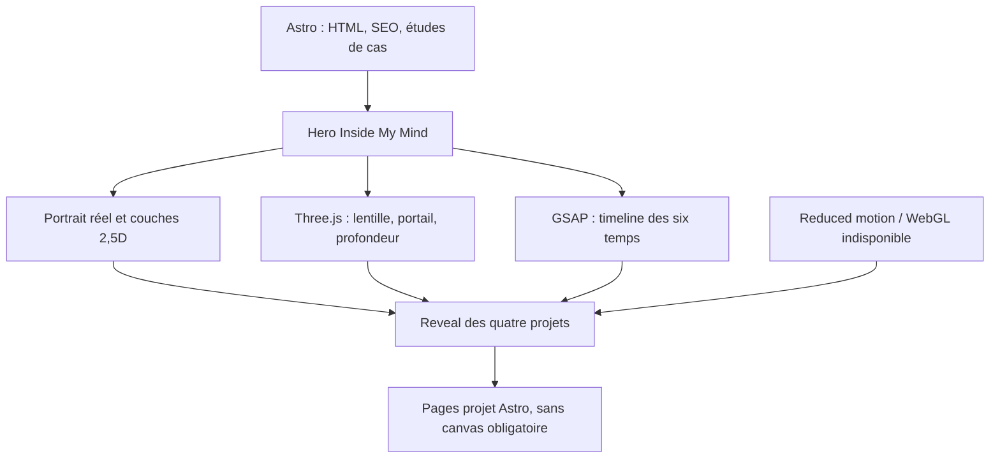

# Recherche GitHub — stacks de portfolios immersifs haut de gamme

## Métadonnées

- Date : 4 septembre 2026
- Sujet : architectures publiques de portfolios et expériences WebGL éditoriales
- Niveau de confiance : élevé pour les dépendances déclarées ; moyen pour la qualité visuelle, qui demande une revue du site rendu
- Méthode : découverte GitHub large, lecture des README et structures publiques, comparaison avec la planche canonique `Inside My Mind`

## Synthèse

Le noyau récurrent est `Three.js + GSAP`, souvent accompagné de Lenis et, dans les projets React, de React Three Fiber. Ce constat ne rend pas Next.js ou React nécessaires : les réalisations les plus cohérentes limitent le canvas à une fonction narrative précise, synchronisent DOM, scroll et WebGL sur une seule horloge, et prévoient un fallback statique.

Pour Nicolas, la meilleure architecture est plus légère : Astro garde le contenu, le référencement et les études de cas dans le DOM ; Three.js ne pilote que le reflet de lentille, le portail et la profondeur du monde intérieur ; GSAP orchestre les six temps. Lenis reste une optimisation conditionnelle après test du scroll natif.

## Projets inspectés

| Projet public | Stack déclarée | Enseignement utile | Limite pour Nicolas |
|---|---|---|---|
| Giorgobiani portfolio | Next 16, React 19, Three WebGPU/TSL, GSAP, Lenis, MDX | Canvas persistant, frontière client explicite, une horloge commune pour scroll et rendu | Architecture trop lourde pour quatre études de cas sans besoin serveur [citation:Dépôt Giorgobiani](https://github.com/Zuzuna54/portfolio) |
| Michael Kolesidis | TypeScript, GSAP, Sass, WebGL ponctuel et React Three Fiber pour un objet 3D | Une identité forte peut rester majoritairement artisanale et réserver WebGL à un effet signature | Direction rétro ludique non transposable ; retenir la retenue technique [citation:Portfolio Michael Kolesidis](https://github.com/michaelkolesidis/michaelkolesidis.com) |
| Cherry Tree | Vite, JavaScript natif, Three.js, shader personnalisé, GSAP, Lenis | Prouve qu'un framework React n'est pas requis pour du scrollytelling WebGL précis ; le rendu peut être différé hors premier affichage | Huit scènes seraient disproportionnées pour l'entrée de quatorze secondes [citation:Cherry Tree](https://github.com/boydcroberts/CherryTree) |
| Portfolio 3D de Jawad | React 19, React Three Fiber, Three.js, GSAP ScrollTrigger | Bon exemple de scène liée au scroll et de séparation interface/canvas | R3F apporte surtout de la valeur quand toute la scène est conçue comme un arbre React [citation:Jawad portfolio v2](https://github.com/jawadhaider0024/jawad-portfolio-v2) |
| React Three Fiber Scroll Rig | React Three Fiber, synchronisation DOM/WebGL et scrolling | Référence technique utile si un canvas React doit rester aligné avec des éléments HTML | À écarter tant qu'Astro + Three.js impératif suffit [citation:R3F Scroll Rig](https://github.com/14islands/r3f-scroll-rig) |

## Convergence technique

### Commun à la majorité des expériences fortes

1. Un canvas WebGL avec un rôle délimité.
2. Three.js ou React Three Fiber pour le rendu.
3. GSAP ScrollTrigger pour les timelines liées au scroll ou à une progression contrôlée.
4. Lenis parfois utilisé pour l'inertie, avec synchronisation explicite à GSAP.
5. Shaders GLSL ou matériaux personnalisés pour les effets de distorsion, grain, réfraction ou transition.
6. Contenu sémantique hors canvas pour le référencement, l'accessibilité et la navigation.
7. Budgets de rendu : pixel ratio plafonné, médias compressés, chargement différé et reduced-motion.

### Ce qui produit souvent un faux « premium »

- accumulation simultanée de GSAP, Framer Motion, Lenis, React Spring et transitions CSS ;
- particules, bloom, curseur magnétique et grain ajoutés sans fonction narrative ;
- scène WebGL permanente alors que seul le hero en bénéficie ;
- dépendance à une animation longue avant l'accès aux projets ;
- absence de fallback lorsque WebGL, les médias ou le mouvement sont indisponibles.

## Architecture retenue

### Dépendances de la tranche initiale

- `astro`, `typescript`, CSS natif : socle existant ;
- `three` : shader de lentille, anneau et espace intérieur ;
- `gsap` avec `ScrollTrigger` si la séquence est liée au scroll, sinon timeline GSAP déclenchée explicitement ;
- pas de React, React Three Fiber, Drei, Framer Motion ou Lenis au premier passage.

### Conditions pour ajouter Lenis

Ajouter Lenis uniquement si les essais montrent une discontinuité perceptible que le scroll natif ne résout pas. Dans ce cas, Lenis, ScrollTrigger et le rendu WebGL doivent partager une seule boucle. Le dépôt officiel confirme la bibliothèque actuelle et son intégration comme moteur de smooth scroll [citation:Lenis](https://github.com/darkroomengineering/lenis).

## Critères de preuve

- portrait utile affiché en moins de 1,5 seconde sur le profil mobile de référence ;
- accès aux projets disponible immédiatement via un lien de passage ;
- 60 images/seconde visées sur desktop et plancher de 30 sur mobile médian ;
- pixel ratio WebGL plafonné à 2 ;
- la scène s'arrête ou réduit son activité hors écran ;
- parcours complet utilisable au clavier ;
- `prefers-reduced-motion` remplace le push-in par une transition courte ;
- perte WebGL ou média : poster, texte et quatre liens restent utilisables.

## Confiance et inconnues

- **Élevée :** Astro + Three.js + GSAP couvre les besoins de la planche sans imposer React.
- **Élevée :** le canvas doit rester limité au récit d'entrée.
- **Moyenne :** Lenis peut améliorer la sensation de scroll, mais sa valeur doit être mesurée sur le prototype.
- **Ouverte :** le niveau de shader et de post-traitement dépendra du découpage réel du portrait et du budget GPU mobile.

## Sources techniques primaires

- [citation:Three.js](https://github.com/mrdoob/three.js)
- [citation:GSAP](https://github.com/greensock/GSAP)
- [citation:Lenis](https://github.com/darkroomengineering/lenis)
- [citation:Astro](https://github.com/withastro/astro)
- [citation:React Three Fiber](https://github.com/pmndrs/react-three-fiber)
